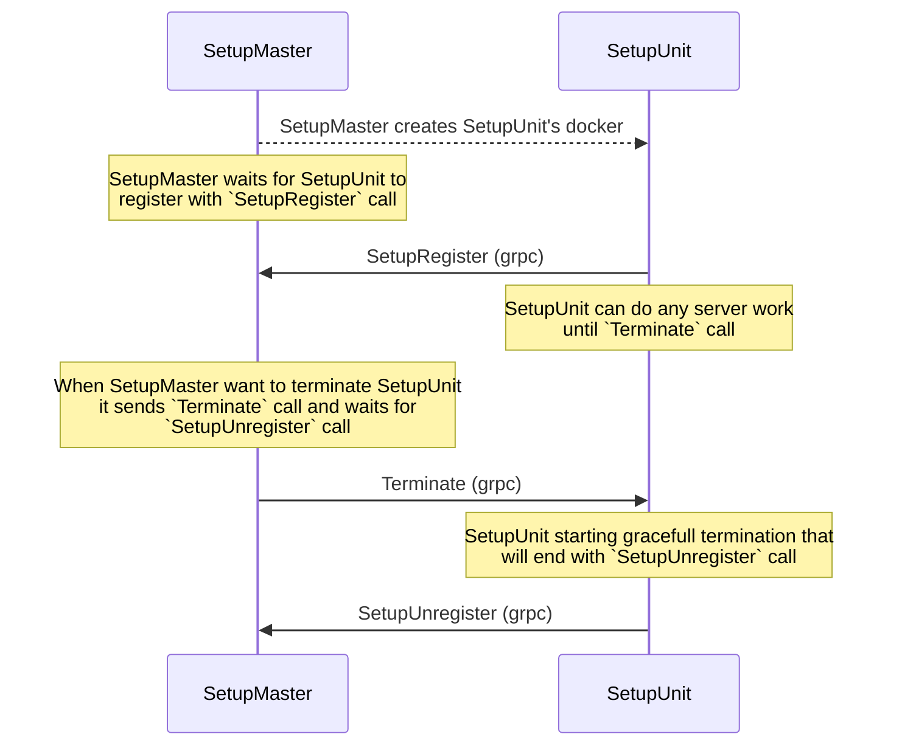
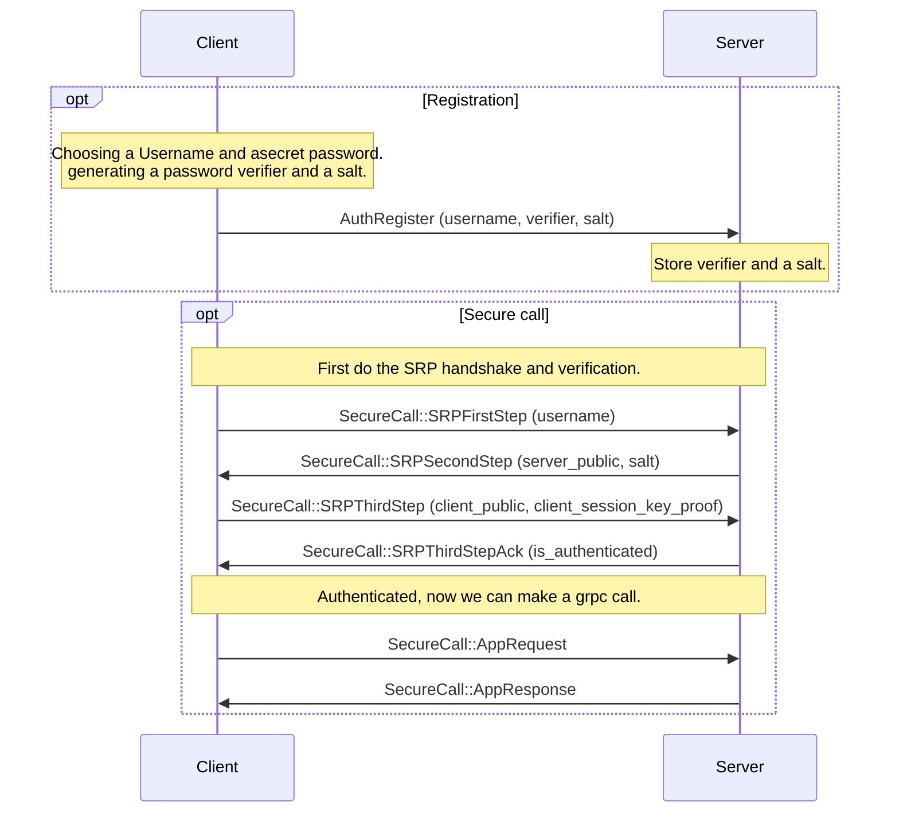

## Setup Process

```mermaid
sequenceDiagram
    participant SetupMaster
    participant SetupUnit

    SetupMaster -->> SetupUnit: SetupMaster creates SetupUnit's docker
    Note over SetupMaster: SetupMaster waits for SetupUnit to<br/>register with `SetupRegister` call

    SetupUnit ->> SetupMaster: SetupRegister (grpc)

    Note over SetupUnit: SetupUnit can do any server work<br/>until `Terminate` call

    Note over SetupMaster: When SetupMaster want to terminate SetupUnit<br/>it sends `Terminate` call and waits for<br/>`SetupUnregister` call

    SetupMaster ->> SetupUnit: Terminate (grpc)
    Note over SetupUnit: SetupUnit starting gracefull termination that<br/>will end with `SetupUnregister` call
    SetupUnit ->> SetupMaster: SetupUnregister (grpc)

```

## Authentication Process

```mermaid
sequenceDiagram
    participant Client
    participant Server

    opt Registration
        Note over Client: Choosing a Username and asecret password.<br/>generating a password verifier and a salt.
        Client ->> Server: AuthRegister (username, verifier, salt)
        Note over Server: Store verifier and a salt.
    end


    opt Secure call
        Note over Client,Server: First do the SRP handshake and verification.
        Client ->> Server: SecureCall::SRPFirstStep (username)
        Server ->> Client: SecureCall::SRPSecondStep (server_public, salt)
        Client ->> Server: SecureCall::SRPThirdStep (client_public, client_session_key_proof)
        Server ->> Client: SecureCall::SRPThirdStepAck (is_authenticated)

        Note over Client,Server: Authenticated, now we can make a grpc call.
        Client ->> Server: SecureCall::AppRequest
        Server ->> Client: SecureCall::AppResponse
    end

```
