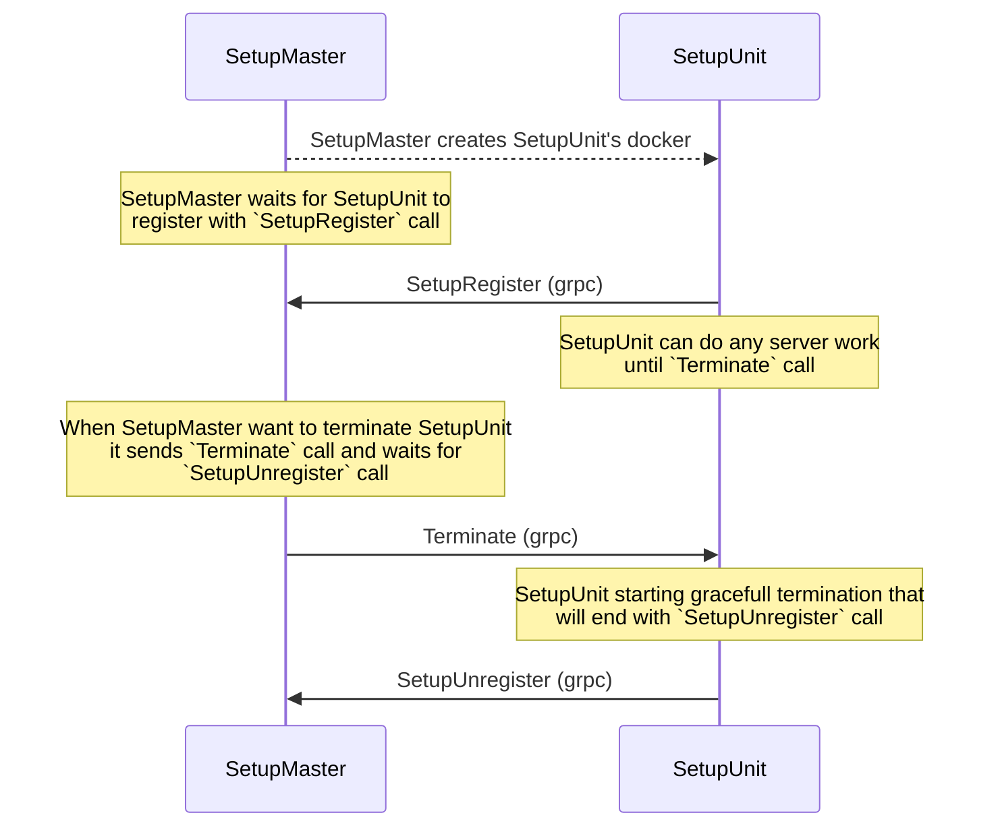
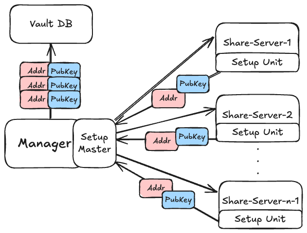
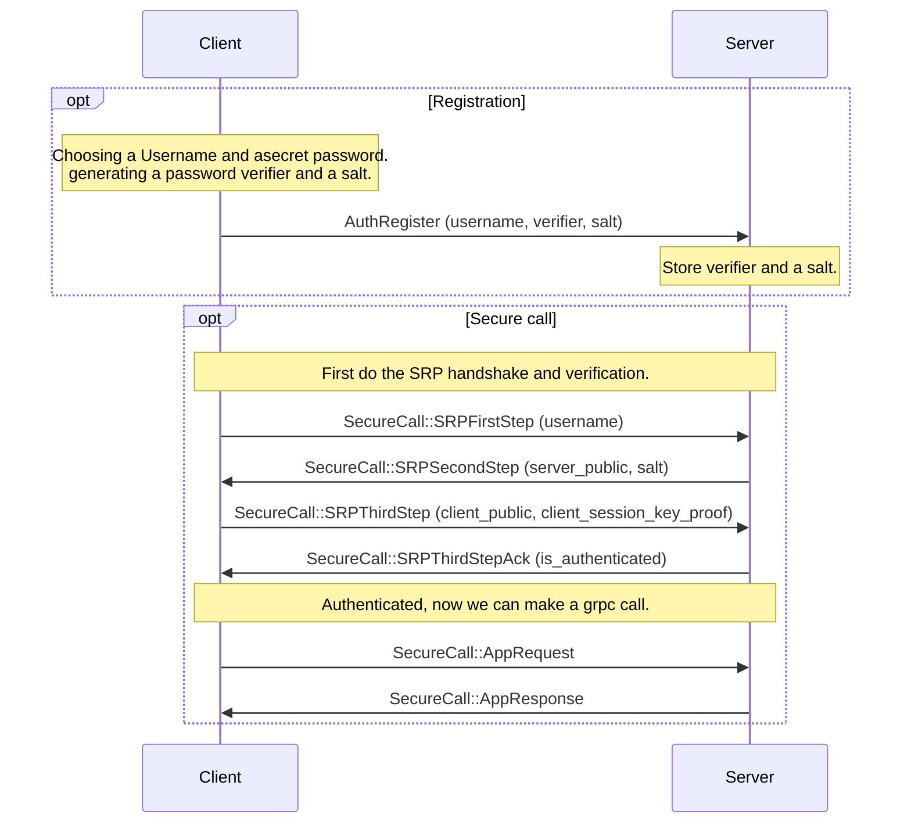

# Advanced Implementation Details

## Secure Communication via gRPC over TLS
All communication between the system components is performed using gRPC, which provides a high-performance and structured RPC framework. To ensure confidentiality and integrity of messages exchanged between the user, manager, bootstrap, and share servers, we run gRPC over TLS. This combination guarantees that all remote procedure calls are both authenticated and encrypted, protecting against eavesdropping, tampering, and man-in-the-middle attacks while maintaining efficient inter-service communication.

When each service is launched, it generates its own TLS certificate signed by a self-signed CA that every service knows both its public and private keys. Each service therefore possesses its own private and public key pair, allowing it to authenticate and encrypt communications with other services. While this approach is not fully secure for a production environment, it effectively demonstrates the concept of mutual TLS and encrypted gRPC communication without adding unnecessary complexity. This design choice allows us to focus on the core functionality and security mechanisms of the password manager system while still illustrating encrypted communication between components.
The CA keys are a part of the docker image of every component.

We use `cryptography` package and `RSA`.
Reference:  [`vault/crypto/certs.py`](/reference/vault/crypto/certs/).

## End-to-End Encryption of Secret Shares
To ensure that secret shares are never exposed in plaintext outside their intended destination, our system employs an end-to-end encryption mechanism during the bootstrap phase.

Upon creation, every share server generates its own asymmetric key pair and transmits its public key to the manager as part of the `SetupUnit` registration process. The manager maintains these public keys for future use but never stores or handles the corresponding private keys.

During user registration, the bootstrap service receives the public keys of the active share servers and the user from the manager. Then before distribution, it encrypts each share with the corresponding public key. This guarantees that only the target recipient, holding the matching private key, can decrypt its assigned share.

This design achieves true end-to-end encryption: the bootstrap service never transmits raw shares, the manager never has the ability to decrypt them, and only the intended recipients can access their respective shares.

We use `pynacl` package and `nacl.public.SealedBox`.
Reference:  [`vault/crypto/asymmetric.py`](/reference/vault/crypto/asymmetric/).

## Threshold Cryptography
Threshold cryptography means a message can be easily encrypted using a simple public key, but the decryption key is divided into n shares, where at least t of them are required to reconstruct the original secret.

To generate encryption key and decryption shares, we use [threshold-crypto](https://github.com/tompetersen/threshold-crypto.git) package, that offers ElGamal-based threshold cryptography.
This package is using a hybrid approach using `pynacl` for symmetric encryption and `PyCryptodome` for ECC operations, therefore there are no limitations regarding the size of the secret.
The integrity of a message is secured using the AE-scheme, meaning changes to some parts of the ciphertext, to partial decryptions or even dishonest share owners can be detected.

Reference:  [`vault/crypto/threshold.py`](/reference/vault/crypto/threshold/).

## System Setup Process
In our system, the generation of secret shares requires a temporary “bootstrap” environment to securely create and handle sensitive data. A key challenge is that this bootstrap Docker container must be terminated immediately after completing its task, to minimize exposure and prevent potential compromise of the secrets.

To address this, we designed a setup architecture composed of a `SetupMaster` and multiple `SetupUnits`. The master orchestrates the lifecycle of containers, spawning setup units as needed to generate shares, and ensures that each unit registers with the master at startup and unregisters before termination. This design guarantees isolation, scalability, and secure handling of secret shares.

Moreover, this infrastructure allows us to send critical data on setup, such as public E2E keys that we will see later, as well as the complement’s new address so the manager will be able to communicate with it.
Building on this infrastructure, we also used the same master-unit architecture to orchestrate the long-lived share servers. By leveraging the established orchestration system, we can manage server deployment, registration, and coordination in a consistent and secure manner, reducing operational complexity while maintaining robust control over the threshold cryptography environment.
The following is a diagram of the setup flow, defined in the `setup.proto` file and implemented in [`setup_master.py`](/reference/vault/manager/setup_master/) and [`setup_unit.py`](/reference/vault/common/setup_unit/) files:

## Authentication
In our project, we adopted the Secure Remote Password (SRP)[https://docs.google.com/document/d/1Z_EgpF2yrcV5xSO_4sjh6dfhYhVUcTOu5AaIe-tk5Ko/edit?pli=1&tab=t.0#heading=h.sjijkwvh5cni] protocol as the primary authentication mechanism. SRP is a password-authenticated key exchange (PAKE) that allows a client and server to establish a shared session key without ever transmitting the password itself. The protocol begins with a registration stage, where the client generates a password verifier and salt, which are then stored by the server. During the authentication stage, the client and server exchange public values derived from their secrets, process the salt and verifier, and independently compute a session key that only matches if the password is correct.
We implemented this flow over gRPC using its streaming feature, enabling a sequence of secure message exchanges between the client and server during authentication.

The following is a diagram of the registration and authentication flow, defined in the `auth.proto` file and implemented in `authenticatiom.py`, `auth_server.py` and `auth_client.py` files:

We designed our product such that every application request (Store secret and Retrieve secret) will have to re-authenticate using the selected password.
The “AppRequest” and “AppResponse” from the diagram above are a wrapper for all possible grpc application requests messages.

This design directly addresses our threat model: even if an attacker compromises the server database, they cannot perform offline password guessing, and even if traffic is observed, no password is leaked to the adversary.

## Using both SRP and TLS
TLS protects the channel, SRP protects the password.
TLS and SRP address different aspects of secure communication. TLS ensures confidentiality and integrity of the data transmitted between client and server, protecting against eavesdropping and tampering. SRP, on the other hand, is a password-authenticated key exchange protocol that allows mutual authentication without ever transmitting the password and prevents offline dictionary attacks even if the server is compromised.
In our design, we combine TLS with SRP to benefit from both: TLS provides a well-established secure transport layer, while SRP adds strong password-based authentication and resistance against server-side credential compromise. Together, they create a more robust and layered security model.
