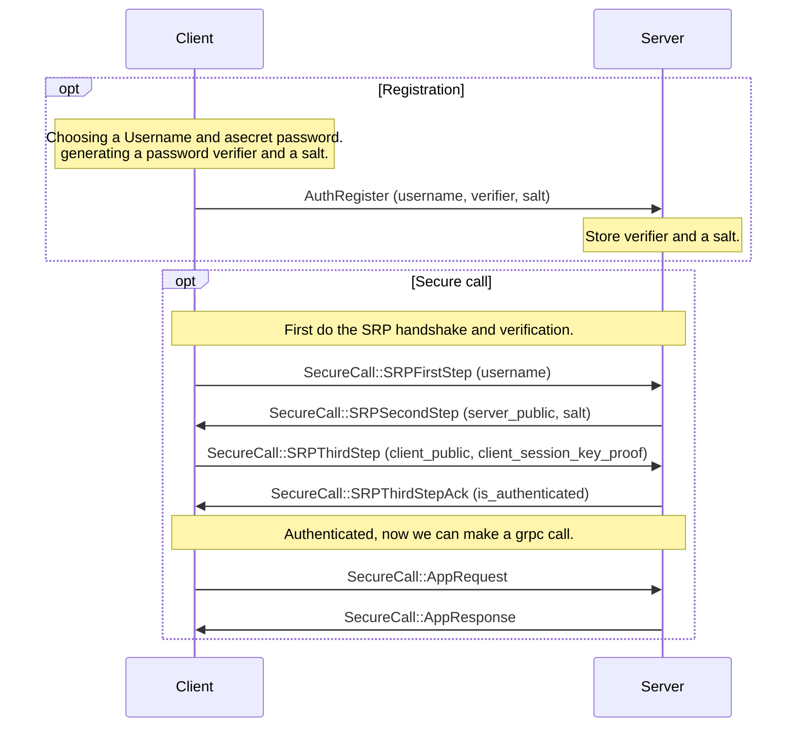

```mermaid
sequenceDiagram
    participant Client
    participant Server

    opt Registration
        Note over Client: Choosing a Username and asecret password.<br/>generating a password verifier and a salt.
        Client ->> Server: AuthRegister (username, verifier, salt)
        Note over Server: Store verifier and a salt.
    end


    opt Secure call
        Note over Client,Server: First do the SRP handshake and verification.
        Client ->> Server: SecureCall::SRPFirstStep (username)
        Server ->> Client: SecureCall::SRPSecondStep (server_public, salt)
        Client ->> Server: SecureCall::SRPThirdStep (client_public, client_session_key_proof)
        Server ->> Client: SecureCall::SRPThirdStepAck (is_authenticated)

        Note over Client,Server: Authenticated, now we can make a grpc call.
        Client ->> Server: SecureCall::AppRequest
        Server ->> Client: SecureCall::AppResponse
    end
```
