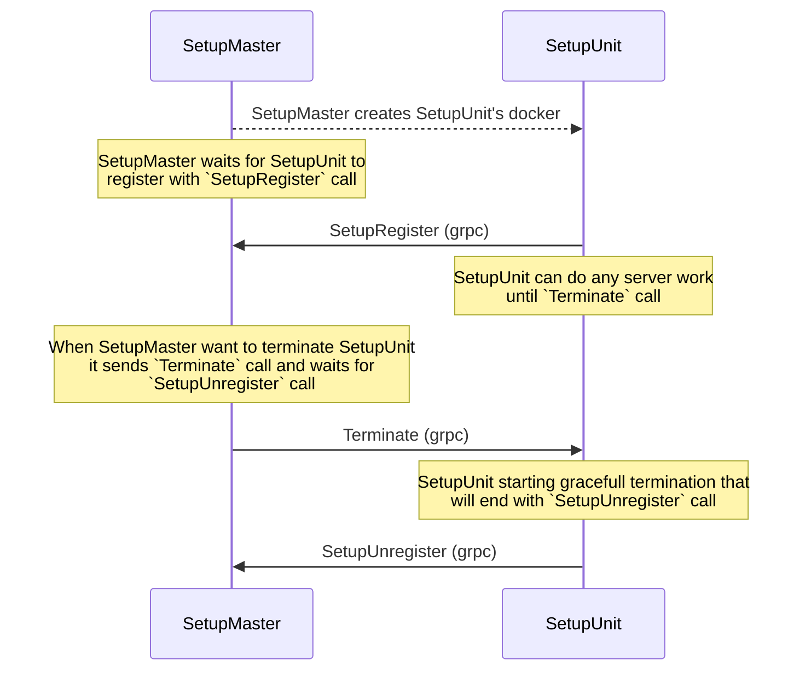

```mermaid
sequenceDiagram
        participant SetupMaster
        participant SetupUnit

        SetupMaster -->> SetupUnit: SetupMaster creates SetupUnit's docker
        Note over SetupMaster: SetupMaster waits for SetupUnit to<br/>register with `SetupRegister` call

        SetupUnit ->> SetupMaster: SetupRegister (grpc)

        Note over SetupUnit: SetupUnit can do any server work<br/>until `Terminate` call

        Note over SetupMaster: When SetupMaster want to terminate SetupUnit<br/>it sends `Terminate` call and waits for<br/>`SetupUnregister` call

        SetupMaster ->> SetupUnit: Terminate (grpc)
        Note over SetupUnit: SetupUnit starting gracefull termination that<br/>will end with `SetupUnregister` call
        SetupUnit ->> SetupMaster: SetupUnregister (grpc)
```
