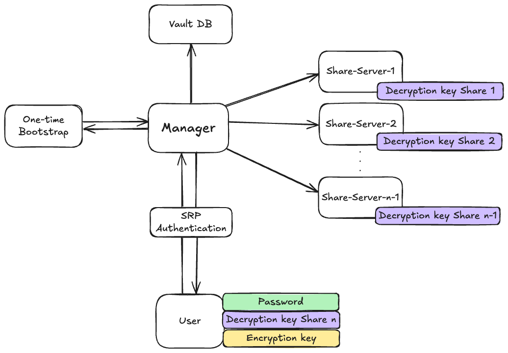

# Design Implementation

## Overview
The project consists of several interacting components designed to securely store and retrieve user secrets:

  

The `User` is the client of the password manager, responsible for registering and authenticating with the system using a password. The user holds the final share of his secret, ensuring that only him can fully reconstruct and access their sensitive data.

The `Manager` service orchestrates all server-side components. It handles requests from users, coordinates the `Bootstrap` and `Share Servers`, and maintains the system state. The manager ensures services are correctly registered, manages Docker lifecycles for short-lived containers, and enforces secure communication over TLS.

`Share Servers` are long-lived server-side components that each hold a portion of a user’s secret. They cooperate to perform threshold cryptography operations but cannot individually reconstruct the secret. These services are orchestrated by the manager to provide controlled access to user data.

The `Bootstrap` service is a temporary, short-lived containerized component responsible for generating secret shares. Each unit registers with the manager, performs its task, and unregisters before being terminated, minimizing exposure and ensuring secure creation of sensitive cryptographic material.

Finally, the `Manager’s Postgres Database` maintains system state and stores user information such as password verifiers, salts, and metadata about secret shares. This database is only accessed by the manager and is never exposed externally, ensuring centralized and secure management of all critical data.

The server-side infrastructure was designed using a distributed trust model. Multiple servers each hold a distinct share of the decryption key, and cooperation among them is required to perform decryption operations. However, the system is intentionally configured so that the servers collectively remain one share short of fully reconstructing the secret. This means that even if all servers are compromised, they cannot independently recover user data. Only the user, who holds the final share, can complete the reconstruction process and regain access to the secret. This design ensures that ultimate control remains with the user while significantly reducing the risks of server-side compromise.

For the purposes of this project, we use Docker containers to conveniently run a full-scale system on a single machine. In a real-world deployment, these services would run on physically distributed servers to maximize security and reliability.

## Implementation Details
The user can do the following operations: Registration, Secret Storage and Secret retrieval
The following are details of each of these operations “behind the scenes".

### User Registration Flow
The registration process establishes both authentication credentials and the cryptographic foundation for secure secret storage. It proceeds as follows:

  

1. The user begins registration by sending to the manager:
    - Their public end-to-end encryption key (used to protect the user’s own share).
    - Their SRP username, verifier, and salt (pre-computed locally from their password).
2. The manager:
    - Stores the received SRP verifier and salt in its DB. Since only the verifier and salt are stored, the manager never learns or stores the plaintext password, ensuring resilience against credential theft.
    - Deploys a short-lived bootstrap service.
    - Sends it a list of public keys and requests it to generate decryption key shares.
3. The bootstrap:
    - Uses threshold cryptography to generate encryption key and decryption key shares
    - Encrypts each share with the corresponding recipient’s public key, ensuring that only the intended party can access their share.
    - Encrypts the encryption key with the user’s public key.
    - Sends all to the manager.
    - Destroys itself.
4. The manager forwards each encrypted share to its respective share server and the user.
5. Each share server and the user store their encrypted share locally.

At the end of registration flow, the system has:
- Stored the user’s SRP credentials for future authentication.
- Securely distributed encrypted shares across the share servers and the user.
- Removed the bootstrap service to ensure no long-lived component retains sensitive material.

### User Secret Storage Flow
After completing registration, a user can securely store secrets in the system. This flow ensures that the manager only persists encrypted data and never learns the secret’s plaintext.

  

1. The user first authenticates against the manager using the SRP protocol with the password established during registration. This step ensures that only the rightful user can request secret storage.
2. As part of the registration process, the user received a public encryption key from the manager.
    - The user encrypts the secret locally with this key.
    - The user sends the encrypted secret to the manager, along with the `user_id` and the `secret_id`. Since the encryption was performed locally, the manager cannot access or derive the plaintext.
3. The manager stores the encrypted secret in its DB.

At the end of this flow, the secret is durably stored in the manager’s database.
Because the manager only handles ciphertext, confidentiality is preserved even in the event of a database compromise.

### User Secret Retrieval Flow
The retrieval flow ensures that secrets can only be reconstructed by the legitimate user, leveraging threshold cryptography and SRP-based authentication.

  

1. The user first authenticates against the manager using the SRP protocol with the password established during registration. This step ensures that only the rightful user can request secret retrieval.
2. The user sends the manager the `user_id` and the `secret_id` corresponding to the stored secret.
3. The manager retrieves the encrypted secret from its DB.
4.
    - The manager sends the encrypted secret to all the registered share servers.
    - Each share server uses its locally stored secret share to produce a partially decrypted secret corresponding to the requested secret.
    - Each share server encrypts the partial decryption with the user's public key.
    - Each share server returns its partial decryption to the manager.
5. The manager sends all the partial decryptions and the encrypted secret to the user. Importantly, the manager does not possess the ability to complete the reconstruction on its own — it can only serve as a coordinator.
6. The user produces its own partial decryption using its locally stored share, and combines it with the partial decryptions received from the share servers to fully reconstruct the original secret.
