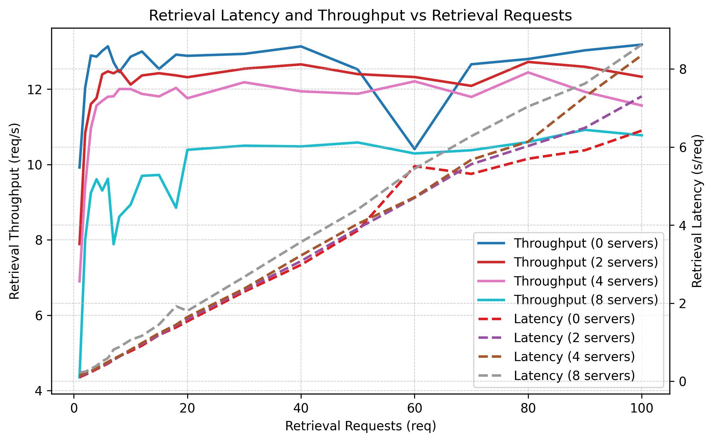
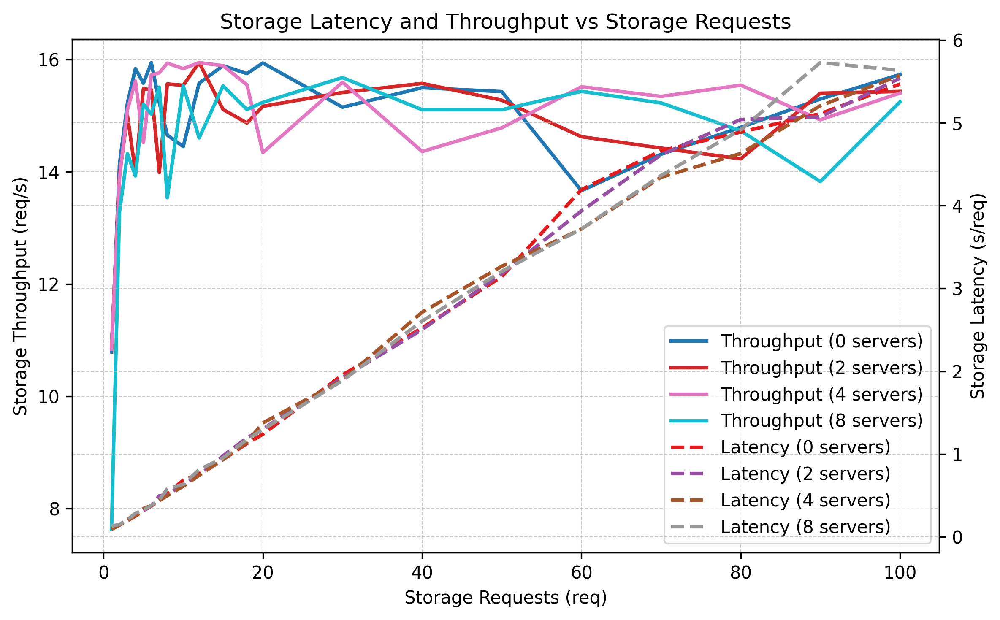

# Evaluation
We chose to present latency and throughput graphs to clearly illustrate the system’s performance under varying load and configurations. These graphs allow us to analyze how operations scale with the number of requests and share servers, highlighting bottlenecks, system limits, and the trade-offs between distributed security and operational efficiency.

## Evaluation Setup
The evaluation was carried out on a MacBook Air equipped with an Apple M2 processor and 8 logical CPUs, with the system running inside a Colima-managed Docker VM. Latency and throughput were measured as functions of the number of system requests, and the results are presented across several configurations with 0, 2, 4, and 8 share servers.

## Evaluation Results

    <table>
    <tr>
        <td></td>
        <td></td>
    </tr>
    </table>

These graphs reveal several important trends:

1. Retrieval throughput decreases as the number of share servers grows. This is expected, since the retrieval operation requires interaction with all share servers, and increasing their number introduces more communication overhead.

2. Storage throughput remains approximately constant regardless of the number of share servers. This aligns with our design, as storage is handled almost exclusively by the manager service and does not require cooperation from the share servers.

3. Retrieval operations are consistently slower than storage operations in both latency and throughput. This is explained by the fact that retrieval requires coordination with multiple share servers, while storage does not.

4. Throughput quickly saturates around 10 concurrent requests. This plateau is an artifact of the environment: with only 8 logical CPUs available, parallel execution is limited by the underlying hardware. On systems with more CPU capacity, we expect higher throughput scalability.

5. Latency grows linearly, even in the region where throughput is still ramping up. This behavior can be explained by queuing effects: as more requests arrive concurrently, they start to wait for CPU or I/O resources, leading to steadily increasing per-request latency, even before the system has fully reached its maximum throughput.

6. Operation times remain practical for end users. Even under peak load on this constrained hardware setup, the worst-case latency observed was around 8 seconds. This is a reasonable waiting time for a user, especially given that the system was stress-tested on a relatively weak machine.

## Evaluation Summary

Overall, the observed performance trends validate the system’s design: storage operations remain lightweight and manager-centric, while retrieval operations naturally incur higher overhead due to their distributed nature. The throughput saturation highlights hardware limitations rather than architectural flaws, suggesting that on more powerful environments the system could scale further. This trade-off between performance and distributed security guarantees appears to be well balanced for the intended use case.
