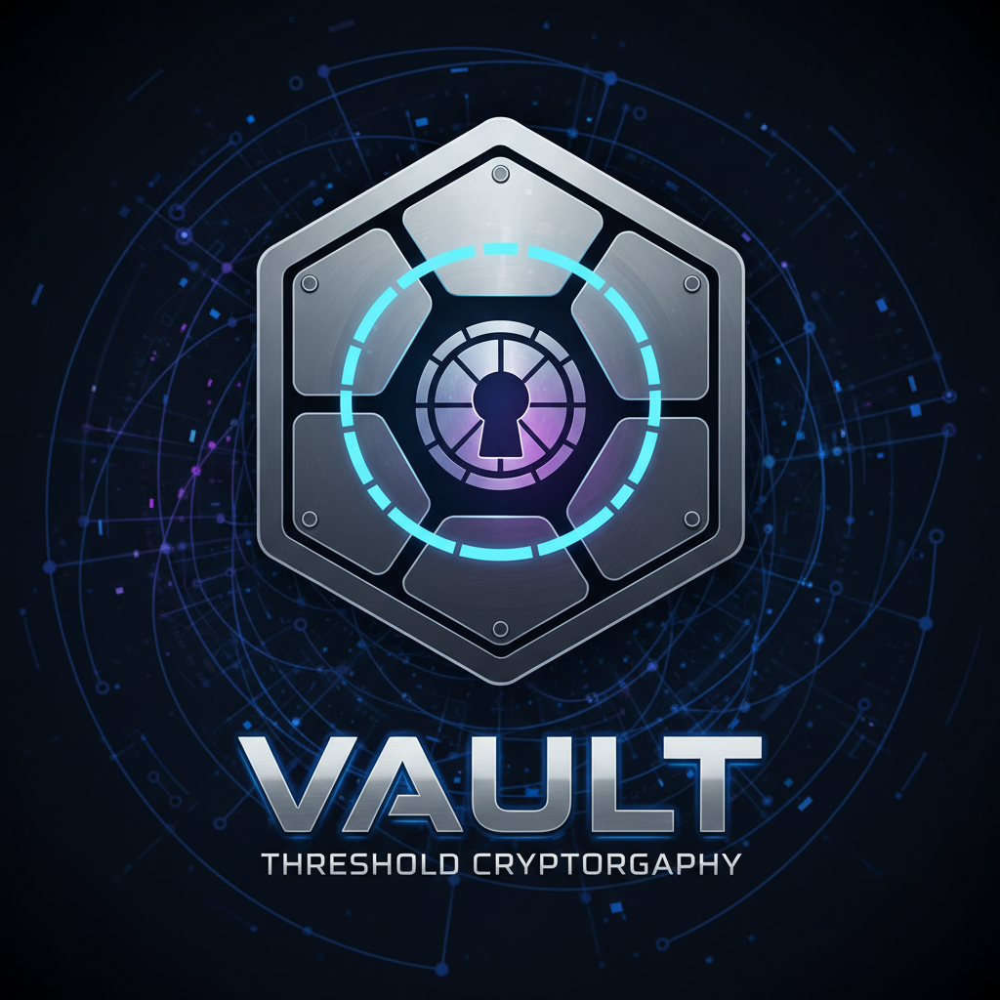

<h1 style="text-align: center;">Vault</h1>

  

## Public Github Repository link
[https://github.com/jonco5555/vault](https://github.com/jonco5555/vault)

## Public Documentation link - Highly recommended instead of reading the pdf
Contains the same content as this pdf, but more convenient.

[https://jonco5555.github.io/vault](https://jonco5555.github.io/vault)

# The Problem space
In modern digital systems, protecting sensitive information such as cryptographic keys, credentials, and personal data is a critical challenge. Secrets are often stored and accessed remotely, which raises the risk that a single server compromise can expose the entire dataset. At the same time, authorized users must be able to reliably retrieve these secrets without excessive complexity or performance overhead. This tension between security, availability, and usability defines the core problem space.

The state of the art in secure storage systems has made significant progress in mitigating these risks, but most conventional approaches still rely on a central trusted server or service.
Such single-trust models introduce a single point of failure: once breached, all stored secrets become vulnerable. Even advanced password hashing and encrypted storage techniques cannot fully eliminate this dependency. As a result, current solutions remain exposed to insider threats, server breaches, and large-scale data leaks.

# Our Solution - The Vault
Our project introduces a secure digital secret manager that we call `Vault`.

The `Vault` is designed to securely store and retrieve sensitive secrets on a remote server. The product combines multiple security primitives — **TLS**, **SRP authentication**, **threshold cryptography**, and **end-to-end encryption** — to create a solution where no single server can compromise a user’s data. At the core of the design, secrets are encrypted by the user before leaving their device, stored only in encrypted form by the manager, and can only be reconstructed through cooperation between multiple share-servers and the user. This ensures that even if attackers gain partial control over the infrastructure, confidentiality of the secrets is preserved.

To support these guarantees, the system architecture introduces several coordinated services:

* `Manager`: Orchestrates all operations, including registration, storage, and retrieval.
* `Bootstrap`: Generates cryptographic shares and is immediately destroyed to reduce the attack surface.
* `ShareServer`: Each holds part of the decryption capability, requiring collaboration to restore user secrets.
* `User`: Communicates with the system over TLS and authenticates via SRP, ensuring resilience against replay and impersonation.

Together, these components form a robust product that addresses the challenges of secure remote secret management.

## Threat model
We assume a powerful attacker with the following capabilities:

1. **Eavesdropping and Tampering**: The attacker can intercept, replay, and modify network traffic between the user, manager, bootstrap, and share servers.
2. **Replay and Impersonation Attempts**: The attacker may try to impersonate the user or replay old authentication messages to trick the system.
3. **Compromised Servers**: The attacker may compromise one or several share servers or even the manager service.
4. **Malicious Bootstrap**: The bootstrap service could be compromised during setup. This risk is mitigated by its short lifetime — it is created for key generation and immediately destroyed.

However, we assume that:

1. The cryptographic primitives (TLS, SRP, asymmetric encryption, threshold cryptography) are secure when used correctly.
2. Not all share servers and the user are compromised simultaneously — at least one share remains honest.
3. The user’s end-to-end encryption key and SRP password are not leaked outside their device.
4. Docker is only a convenience layer; in real deployments, services would run on isolated servers with strong operational security.
5. The manager is not compromised during the user registration phase, otherwise it could send malicious public keys to the bootstrap.

## Design Motivation
Given this attacker model, the design addresses the threats as follows:

1. **TLS for all communication**: Protects against eavesdropping and tampering on the network, ensuring confidentiality and integrity of traffic between all services.
2. **SRP authentication**: Protects against replay attacks and password theft, since the password is never transmitted nor derivable from intercepted data. Even a compromised manager cannot recover the user’s password.
3. **Threshold cryptography with missing user share**: Ensures that neither the manager nor any subset of share servers can decrypt secrets on their own. The user’s cooperation is always required to complete decryption, preserving end-to-end security even if some servers are compromised.
4. **Short-lived bootstrap service**: Limits exposure of the most sensitive operation — key generation. By destroying the bootstrap immediately after setup, the attack surface is minimized.
5. **End-to-end encryption of shares**: Guarantees that shares are only usable by their intended recipients (user and share servers). The manager cannot read or misuse them.
